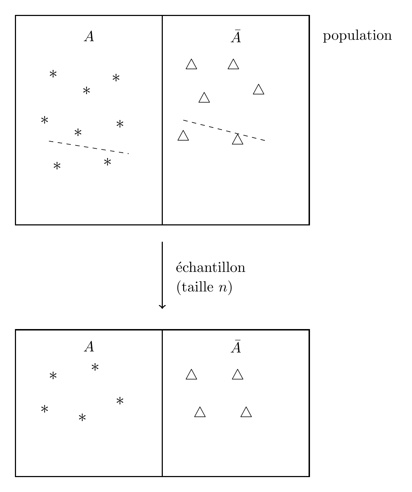
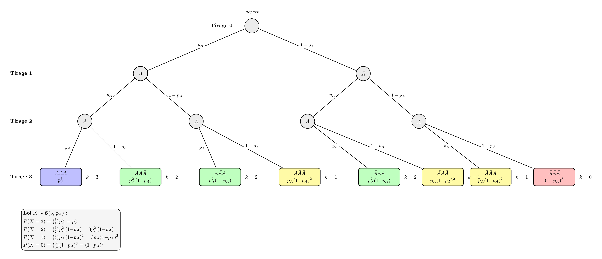

# Estimation d'une proportion

On prend un exemple simple : on veut estimer la proportion d'individu dans une population qui possède une caractéristique $A$ (par exemple un phénotype donné). Pour chaque individu de la population il possède la caractéristique $A$ ou ne la possède pas ($\bar{A}$). On note $p_A$ la proportion recherchée.

La population totale n'est souvent pas observable, on tire un échantillon (en respectant un certain nombre de contraintes pour qu'il soit "représentatif").
{fig-align="center" width="60%"}

Et la proportion $p_A$ est alors estimée par $$p_A\simeq\frac{n_A}{n}.$$ Le problème est qu'à ce stade on ne connaît pas la précision de cette estimation.

On peut utiliser un procédé générique pour estimer $p_A$

::: callout-important
## Principe de Monte Carlo

On tire $B$ ($B=10000$ en général) échantillons de taille $n$ dans la population en supposant connaitre le paramètre $p_A$ et pour chacun de ces $B$ échantillons on calcule la proportion d'individus possédant la caractérisque $A$, on note $\hat p^{(1)}_A,...\hat p^{(B)}_A$ les proportions obtenues.

- Estimation de $p_A$ : $\hat p_A=\displaystyle{\frac{\hat p^{(1)}_A+...+\hat p^{(B)}_A}{B}}$.

- Erreur d'estimation de $p_A$ : $\frac{1}{B-1} \sum\_{b=1}^B (\hat p^{(b)}_A-\hat p_A)^2$
:::

Le principe de Monte Carlo permet donc d'avoir une idée de l'estimation d'un paramètre 


On va utiliser la loi binomiale $\mathcal B(n,p_A)$ 

{fig-align="center" width="60%"}

```{r}
pA <- 0.3   # proportion vraie (dans la vraie vie, inconnue)
n      <- 10  # taille d'échantillon
B      <- 10000 # nombre de simulations

# B échantillons → B proportions estimées
pA_est <- rbinom(B, size = n, prob = pA) / n

mean(pA_est)        
var(pA_est)         
```

Répéter plusieurs fois cette expérience vous constaterez que l'on n'obtient pas toujours les mêmes estimations et erreurs d'estimation...
C'est la fluctuation d'échantillonage....

# Intervalle de confiance (IC) d'une proportion :

Cette notion est difficile (car probabiliste). On va essayer de la comprendre sur des exemples.
On va utiliser une autre technique de simulation appelée le bootstrap paramétrique :

::: callout-important
## Principe du bootstrap paramétrique

On tire $B$ ($B=10000$ en général) échantillons de taille $n$ dans la population mais on ne connait pas le paramètre $p_A$, donc il est estimé dans un premier temps. Ensuit le principe est le même : pour chacun de ces $B$ échantillons on calcule la proportion d'individus possédant la caractérisque $A$, on note $\hat p^{(1)}_A,...\hat p^{(B)}_A$ les proportions obtenues.

- Estimation de $p_A$ : $\hat p_A=\displaystyle{\frac{\hat p^{(1)}_A+...+\hat p^{(B)}_A}{B}}$.

- Erreur d'estimation de $p_A$ : $\frac{1}{B-1} \sum\_{b=1}^B (\hat p^{(b)}_A-\hat p_A)^2$
:::

```{r echo=F}
library(gt)

tibble::tribble(
  ~Critère,        ~`Monte Carlo`,                          ~`Bootstrap paramétrique`,
  "On simule sous", "la vraie loi ($p_A$ connu)",           "la loi estimée ($\\hat{p}_A$ à la place de $p_A$)",
  "Usage",          "calcul théorique, calibration",         "inférence en pratique",
  "Biais",          "aucun (si loi bien spécifiée)",         "biais d'estimation en $\\hat{p}_A - p_A$",
  "Hypothèse",      "forme **et** paramètre connus",         "forme connue, paramètre inconnu"
) |>
  gt() |>
  fmt_markdown(columns = everything()) |> 
  tab_header(
    title    = "Monte Carlo vs Bootstrap paramétrique"
  ) |>
  tab_style(
    style = cell_text(weight = "bold"),
    locations = cells_column_labels()
  ) |>
  tab_style(
    style = cell_text(weight = "bold"),
    locations = cells_body(columns = Critère)
  ) |>
  tab_style(
    style = cell_fill(color = "#f0f0f0"),
    locations = cells_body(rows = c(1, 3))
  ) |>
  cols_align(align = "left") |>
  opt_table_font(font = google_font("Source Sans Pro")) |>
  tab_options(
    table.border.top.color    = "#2c3e50",
    table.border.bottom.color = "#2c3e50",
    column_labels.border.bottom.color = "#2c3e50",
    heading.title.font.size   = 14,
    heading.align             = "left"
  )
```


Une estimation d'un $IC$ à la confiance $\alpha$ est donnée par :
$$\widehat{IC}_\alpha=[\hat q_{\alpha/2},\hat q_{1-\alpha/2}]$$ où $\hat q$ est le quantile empirique estimé par boostrap paramétrique 
On va calculer le taux de couverture empirique qui est la proportion d'IC qui contiennent la vraie valeur du paramètre.
Celui-ci doit être proche du taux nominal (c'est à dire $1-\alpha$).

```{r}
set.seed(15)
# --- Paramètres ---
p_A   <- 0.3   # vraie proportion
n     <- 50    # taille d'échantillon
N_rep <- 100   # nombre de répétitions
B <- 10000
alpha <- 0.1


# --- Simulation ---

resultats=data.frame(p_hat=rep(NA,N_rep),borne_inf=rep(NA,N_rep),borne_sup=rep(NA,N_rep))

for(i in 1:N_rep){
    p_hat<-rbinom(1, size = n, prob = p_A) / n
    simu<-rbinom(B, size = n, prob = p_hat) / n
    ic<-quantile(simu,probs=c(alpha/2,1-alpha/2))
    resultats$p_hat[i]<-p_hat
    resultats$borne_inf[i]<-ic[[1]]
    resultats$borne_sup[i]<-ic[[2]]
}

resultats$contient <- resultats$borne_inf <= p_A & p_A <= resultats$borne_sup
resultats$couleur  <- ifelse(resultats$contient, "#2ecc71", "#e74c3c")
resultats$rep<-1:N_rep
taux <- mean(resultats$contient)

cat("Taux de couverture :", round(taux * 100, 1), "%\n")


# Graphique 
library(ggplot2)
ggplot(resultats, aes(y = rep, color = contient)) +
  geom_segment(aes(x = borne_inf, xend = borne_sup, yend = rep),
               linewidth = 0.8) +
  geom_point(aes(x = p_hat), size = 1.2) +
  geom_vline(xintercept = p_A, linetype = "dashed",
             color = "#2c3e50", linewidth = 0.9) +
  annotate("text", x = p_A + 0.01, y = N_rep + 1.5,
           label = paste0("p[A]==", p_A),
           parse = TRUE, hjust = 0, size = 3.5, color = "#2c3e50") +
  scale_color_manual(
    values = c("TRUE" = "#2ecc71", "FALSE" = "#e74c3c"),
    labels = c(
      "TRUE"  = paste0("Contient p_A  (", sum( resultats$contient), "/100)"),
      "FALSE" = paste0("Ne contient pas p_A  (", sum(!resultats$contient), "/100)")
    )
  ) +
  scale_x_continuous(limits = c(max(0, p_A - 0.35), min(1, p_A + 0.35))) +
  labs(
    x     = expression(p[A]),
    y     = "Répétition",
    color = NULL,
    title = paste0("100 IC à ",100*(1-alpha),"% par quantiles Monte Carlo  (B = ", B, ")"),
    subtitle = paste0("Taux de couverture empirique : ", round(taux * 100, 1), "%")
  ) +
  theme_minimal(base_size = 12) +
  theme(
    legend.position  = "top",
    panel.grid.minor = element_blank(),
    plot.title       = element_text(face = "bold")
  )
```

Le taux de couverture dépend de $n$, plus $n$ est grand plus le taux de couverture empirique va être proche de la valeur nominale.

::: callout-important
## Interprétation du niveau de confiance d'un IC

- Si on répète l'expérience un grand nombre de fois, environ 90% des IC obtenus contiendront $p_A$ (c'est ce qu'on voit sur l'illustration précédente).

- Pour un IC donné on ne sait pas si il contient ou pas la vraie valeur $p_A$ !!!! Si on n'a pas de chance on aura obtenu l'un des 7 intervalles qui ne le contient pas.

:::


::: callout-note
## Exercice 1
Reprendre le code du bootstrap paramétrique en fixant $Nrep=5000,B=5000,\alpha=0.05$.

Calculer le taux de converture empirique en considérant :

- $n=10,100,200$ et $p_A=0.3$. Que constate t'on ?

- $n=100$ et $p_A=0.1,0.05,0.01$. Que constate t'on ? 

:::


# Estimation de la moyenne d'une population

## Etude théorique

On considère une population de rats de souche Whistar Kyoto. On voudrait estimer le poids moyen de cette population. 
On n'a pas d'idée sur la distribution des poids donc on commence par considérer que le poids est distribué uniformément entre 200g et 250g.

On fait alors des simulations selon la méthode de Monte Carlo en supposant que l'on a des échantillons de $n=30$ rats.  

```{r}
set.seed(3344)
n      <- 30  # taille d'échantillon
B      <- 10000 # nombre de simulations
m<-200
M<-250

moy_est<-rep(NA,B)
# B échantillons → B proportions estimées
for(b in 1:B){
moy_est[b]<-mean(runif(n,min=m,max=M))
}

ggplot(data.frame(moy_est), aes(x = moy_est)) +
  geom_histogram(aes(y = after_stat(density)),
                 bins = 50,
                 fill = "#3498db", color = "white", alpha = 0.7) +
  geom_density(color = "#e74c3c", linewidth = 1) +
  labs(
    x     = "Moyenne estimée",
    y     = "Densité",
    title = "Distribution de la moyenne empirique",
    subtitle = bquote(U(200, 250) ~ "," ~ n == .(n) ~ "," ~ B == .(B))
  ) +
  theme_minimal(base_size = 12) +
  theme(
    plot.title    = element_text(face = "bold"),
    panel.grid.minor = element_blank()
  )
```


Ceci illustre un théorème fondamental de mathématiques (Théorème central limite)

::: callout-important
## Théorème Central Limite
On considère une variable $X$ de moyenne $\mu$ et d'écart type $\sigma$. On note $\bar X_n$ la moyenne d'un échantillon de taille $n$. Lorsque $n\to \infty$ 

$$\sqrt{n}\times \frac{\bar X_n-\mu}{\sigma} \simeq \mathcal N(0,1).$$

:::


Reprenons l'exemple précédent on a supposé que le poids suivait une loi uniforme $\mathcal U[m,M]$. La moyenne de cette loi est $\mu=\frac{m+M}{2}=225$ et l'écart type est $\sigma=\frac{M-m}{\sqrt 12}=14.43$.


```{r}
mu<-(m+M)/2
sig<-(M-m)/sqrt(12)
z_est=sqrt(n)*(moy_est-mu)/sig
ggplot(data.frame(z_est), aes(x = z_est)) +
  geom_histogram(aes(y = after_stat(density)),
                 bins = 50,
                 fill = "#3498db", color = "white", alpha = 0.7) +
  stat_function(fun  = dnorm,
                args = list(mean = 0, sd = 1),
                color = "#e74c3c", linewidth = 1) +
  labs(
    x        = "Variable centrée réduite",
    y        = "Densité",
    title    = "Distribution de la moyenne empirique standardisée",
    subtitle = bquote(U(.(m), .(M)) ~ "," ~ n == .(n) ~ "," ~ B == .(B))
  ) +
  theme_minimal(base_size = 12) +
  theme(
    plot.title       = element_text(face = "bold"),
    panel.grid.minor = element_blank()
  )
```

On a dessiné la loi normale centrée réduite et on constate que l'on est proche...

Le problème c'est qu'un général on ne connait ni la loi, ni les paramètres de celle-ci ...

```{r echo=F}
library(gt)

tibble::tribble(
  ~Cas,                                 ~`Hypothèse`,                                        ~`Méthode`,           ~`Distribution de $\\bar{X}_n$`,
  "Loi connue, paramètres estimés",     "Forme connue, $\\hat\\mu$ et $\\hat\\sigma$ ",         "TCL + plug-in",      "$\\sqrt{n}\\times \\frac{\\bar X_n-\\hat\\mu}{\\hat\\sigma}\\simeq\\mathcal{N}(0,1)$ asymptotique",
  "Gaussien, $\\sigma^2$ inconnu",      "$X \\sim \\mathcal{N}(\\mu, \\sigma^2)$",           "Loi de Student",     "$\\sqrt{n}\\times \\frac{\\bar X_n-\\mu}{\\hat\\sigma}\\sim t(n-1)$ exact",
  "Loi complètement inconnue",          "Aucune hypothèse sur la forme",                     "Bootstrap non-param.", "Empirique (quantiles des rééchantillons)"
) |>
  gt() |>
  fmt_markdown(columns = everything()) |>
  tab_header(
    title    = "Distribution de la moyenne selon les hypothèses",
    subtitle = "Trois situations selon le degré d'information disponible"
  ) |>
  tab_style(
    style    = cell_text(weight = "bold"),
    locations = cells_column_labels()
  ) |>
  tab_style(
    style    = cell_text(weight = "bold"),
    locations = cells_body(columns = Cas)
  ) |>
  tab_style(
    style    = cell_fill(color = "#eaf4fb"),
    locations = cells_body(rows = 1)
  ) |>
  tab_style(
    style    = cell_fill(color = "#eafaf1"),
    locations = cells_body(rows = 2)
  ) |>
  tab_style(
    style    = cell_fill(color = "#fef9e7"),
    locations = cells_body(rows = 3)
  ) |>
  tab_footnote(
    footnote  = "Valide asymptotiquement (n grand). Pour n petit, l'approximation peut être mauvaise.",
    locations = cells_body(columns = `Distribution de $\\bar{X}_n$`, rows = 1)
  ) |>
  cols_align(align = "left") |>
  opt_table_font(font = google_font("Source Sans Pro")) |>
  tab_options(
    table.border.top.color        = "#2c3e50",
    table.border.bottom.color     = "#2c3e50",
    column_labels.border.bottom.color = "#2c3e50",
    heading.title.font.size       = 14,
    heading.subtitle.font.size    = 11,
    heading.align                 = "left"
  )
```

## Comparaison sur un exemple

Charger le fichier [data]("data/poids_naissance.csv"). Il contient les poids (kg) à la naissance d'agneaux.

On veut estimer le poids moyen d'un agneau à la naissance et un IC à 95% de cette moyenne.

### Première approche on suppose la loi connue

On suppose que les poids sont uniformément distribués et que les paramètres de la loi sont égaux aux paramètres estimés sur l'échantillon.

::: callout-note
## Exercice 2
Estimer l'intervalle de confiance. (on pourra faire le graphique de la distribution des moyennes dans ce cas). 
:::

### Deuxième approche on suppose que la loi est normale

On suppose que les poids sont normalement distribués.

::: callout-note
## Exercice 2
Reprendre le code précédent pour estimer l'intervalle de confiance. (on pourra faire le graphique de la distribution des moyennes dans ce cas). 
:::

### Troisième approche : bootstrap non paramétrique

```{r}
data<-read.csv("data/poids_naissance.csv",sep=",",dec=".")
poids<-unlist(data)
length(poids)

```
