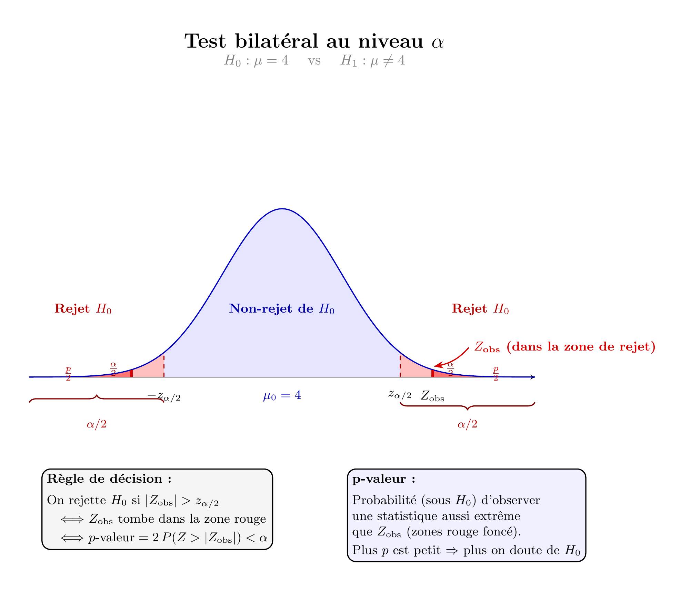

# Introduction

Les tests d'hypothèse sont très utilisés dans les sciences biologiques et humaines.

Revenons à l'exemple du poids des agneaux à la naissance. On veut tester statistiquement si le poids moyen est significativement différent de 4 kg.

étape 1 : On va supposer que la moyenne n'est pas significativement différente de 4 (hypothèse nulle $H_0:\mu=4$).

étape 2 : On prélève un échantillon de taille $n$ et on calcule sa moyenne $\bar X_n$. On connait la distribution sous $H_0$ de $Z=\sqrt{n}\times \frac{\bar X_n-4}{\hat\sigma}$, c'est une loi $\mathcal N(0,1)$.

étape 3 : On calcule $p.value=\mathbb P(|Z|>z_{obs})$ où $z_{obs}$ est la valeur de $Z$ calculée sur l'échantillon observé.

étape 4 : On rejette l'hypothèse $H_0$ au risque $\alpha$ lorsque $$p.value<\alpha$$



## Mise en oeuvre sur R

On reprend les données concernant les agneaux, on commence toujours par une analyse descriptive des données :

```{r}
data<-unlist(read.csv("data/poids_naissance.csv",sep=";",dec="."))
library(ggplot2)
ggplot(data.frame(poids=data),aes(y=poids))+
  geom_boxplot()+
  geom_hline(yintercept = 4,color="red")+
  theme_bw()
# Moyenne des poids
mean(data)
# Ecart type estimé des poids
sd(data)
```

La mise en oeuvre du test se fait via la fonction t.test().

```{r}
t.test(data,mu = 4)
```

Lecture du résultat :

- La valeur de $t$ correspond à la valeur de la statistique calculée sur les données observées. Remarque $t=0$ correspond à la moyenne de l'écahntillon est égale à la valeur testée (ici $\mu=4$).

- Le $df$ (degree of freedom) est le degré de liberté. C'est le nombre d'informations indépendantes disponible pour estimer la statistique $T=\frac{\bar X_n-\mu}{\hat\sigma}$. Ici c'est $n-1$ car pour calculer $\hat\sigma$ on a $n-1$ valeurs indépendantes (la moyenne est calculée à partir des $n$ valeurs observées).

- La p-value est $\mathbb P_{\mathcal H_0}(|T|>t)$. Elle vaut ici p-value= `r t.test(data,mu = 4)$p.value`

::: callout-important
## Conclusion du test

- Conclusion statistique du test : Au risque de \$5\\%\$, on ne peut pas rejeter l'hypothèse $\mathcal H_0$ (\$t(64)=-0.80,p=0.428\$).

- Conclusion : Le poids moyen à la naissance de la population d'agneau n'est pas significativement différente de 4 kg.
:::

# Test de comparaison de deux moyennes

Il s'agit du test de Student. Il repose sur des hypothèses concernant la forme de la distributions des données :

::: callout-tip
## Test de Student

On considère une caractéristique $X$ dont la distribution est connue sur deux poulations $A,B$ :$$X_A\sim \mathcal N(\mu_A,\sigma_A), \quad X_B\sim \mathcal N(\mu_B,\sigma_B).$$
On a deux cas :

- (Student classique) les variance $\sigma_A^2,\sigma^2_B$ sont inconnues mais supposées égales. On estime la variance commune $s_p^2=\frac{n_As^2_A+n_Bs^2_B}{n_A+n_B-2}$ et on a 
$$T=\frac{\bar X_A-\bar X_B}{s_P\sqrt{\frac{1}{n_A}+\frac{1}{n_B}}}\sim t_{n_A+n_B-2}.$$
- Welch les variance $\sigma_A^2,\sigma^2_B$ sont inconnues et inégales. On estime chaque variance et on a 
$$T=\frac{\bar X_A-\bar X_B}{\sqrt{\frac{s^2_A}{n_A}+\frac{s^2_B}{n_B}}}\sim t_{\nu}.$$
:::

