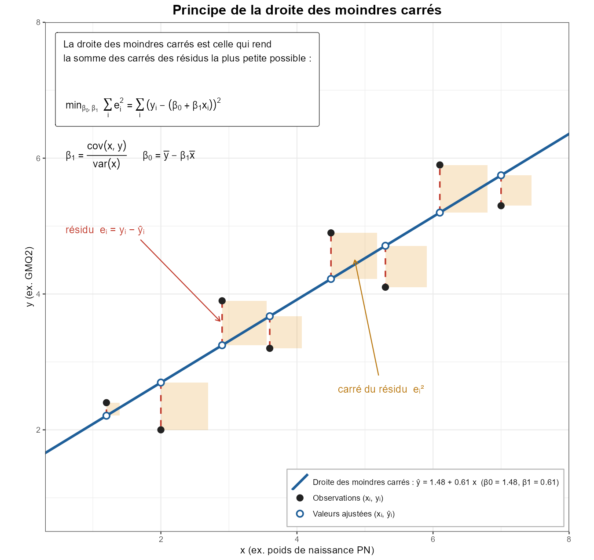

# Introduction

Les tests d'hypothèse sont très utilisés dans les sciences biologiques et humaines.

Revenons à l'exemple du poids des agneaux à la naissance. On veut tester statistiquement si le poids moyen est significativement différent de 4 kg.

étape 1 : On va supposer que la moyenne n'est pas significativement différente de 4 (hypothèse nulle $H_0:\mu=4$).

étape 2 : On prélève un échantillon de taille $n$ et on calcule sa moyenne $\bar X_n$. On connait la distribution sous $H_0$ de $Z=\sqrt{n}\times \frac{\bar X_n-4}{\hat\sigma}$, c'est une loi $\mathcal N(0,1)$.

étape 3 : On calcule $p.value=\mathbb P(|Z|>z_{obs})$ où $z_{obs}$ est la valeur de $Z$ calculée sur l'échantillon observé.

étape 4 : On rejette l'hypothèse $H_0$ au risque $\alpha$ lorsque $$p.value<\alpha$$


## Mise en oeuvre sur R

On reprend les données concernant les agneaux, on commence toujours par une analyse descriptive des données :

```{r}
load("data/Agneaux.RData")
data<-unlist(Agneaux$PN)
library(ggplot2)
ggplot(data.frame(poids=data),aes(y=poids))+
  geom_boxplot()+
  geom_hline(yintercept = 4,color="red")+
  theme_bw()
# Moyenne des poids
mean(data)
# Ecart type estimé des poids
sd(data)
```

La mise en oeuvre du test se fait via la fonction t.test().

```{r}
t.test(data,mu = 4)
```

Lecture du résultat :

- La valeur de $t$ correspond à la valeur de la statistique calculée sur les données observées. Remarque $t=0$ correspond à la moyenne de l'écahntillon est égale à la valeur testée (ici $\mu=4$).

- Le $df$ (degree of freedom) est le degré de liberté. C'est le nombre d'informations indépendantes disponible pour estimer la statistique $T=\frac{\bar X_n-\mu}{\hat\sigma}$. Ici c'est $n-1$ car pour calculer $\hat\sigma$ on a $n-1$ valeurs indépendantes (la moyenne est calculée à partir des $n$ valeurs observées).

- La p-value est $\mathbb P_{\mathcal H_0}(|T|>t)$. Elle vaut ici p-value= `r t.test(data,mu = 4)$p.value`

::: callout-important
## Conclusion du test

- Conclusion statistique du test : Au risque de \$5\\%\$, on ne peut pas rejeter l'hypothèse $\mathcal H_0$ (\$t(64)=-0.80,p=0.428\$).

- Conclusion : Le poids moyen à la naissance de la population d'agneau n'est pas significativement différente de 4 kg.
:::

# Test de comparaison de deux moyennes


Il s'agit du test de Student. Il repose sur des hypothèses concernant la forme de la distributions des données :

::: callout-tip
## Test de Student

On considère une caractéristique $X$ dont la distribution est connue sur deux poulations $A,B$ :$$X_A\sim \mathcal N(\mu_A,\sigma_A), \quad X_B\sim \mathcal N(\mu_B,\sigma_B).$$
On veut tester l'hypothèse il n'existe pas de différence significative entre les deux moyennes c'est à dire : $$\mathcal H_0:\mu_A=\mu_B, \quad versus \quad \mathcal H_1:\mu_A\not =\mu_B.$$
On a deux cas :

- (Student classique) les variance $\sigma_A^2,\sigma^2_B$ sont inconnues mais supposées égales. On estime la variance commune $s_p^2=\frac{n_As^2_A+n_Bs^2_B}{n_A+n_B-2}$ et on a 
$$T=\frac{\bar X_A-\bar X_B}{s_P\sqrt{\frac{1}{n_A}+\frac{1}{n_B}}}\sim t_{n_A+n_B-2}.$$
- (Welch) les variance $\sigma_A^2,\sigma^2_B$ sont inconnues et inégales. On estime chaque variance et on a 
$$T=\frac{\bar X_A-\bar X_B}{\sqrt{\frac{s^2_A}{n_A}+\frac{s^2_B}{n_B}}}\sim t_{\nu}.$$
où $\nu$ est le degré de liberté calculé en fonction de $n_A,n_B$.

Dans les deux cas on a $p.value=\mathbb P_{\mathcal H_0}(|T|>t_{obs})$
:::

Reprenons le fichier Agneaux :

::: callout-note
## Exemple
On veut savoir si il existe une différence statistique entre les poids moyens des agneaux selon le sexe.
On va tester l'hypothèse $H_0:\mu_F=\mu_M$.  

:::

Comme précédemment on commence par une analyse descriptive des données :

- sous forme de graphiques :
```{r}
ggplot(Agneaux,aes(x=Sexe,y=PN))+
  geom_boxplot()+
  theme_bw()
```


-sous forme de tableau :

```{r}
library(dplyr)
library(gt)
Agneaux |>
  group_by(Sexe) |>
  summarise(M=mean(PN),SD=sd(PN))|>
  gt() |>
  fmt_number(
    decimals = 2
  )
```

On peut alors faire les deux versions du test de Student 

```{r}
t.test(PN~Sexe, data=Agneaux,var.equal=T)
t.test(PN~Sexe, data=Agneaux)
```

Les résultats sont proches (car ....).

On en déduit qu'au risque de 5% on ne peut pas rejeter l'hypothèse $H_0$. Donc il n'existe pas de différence significative de poids moyen des agneaux selon le sexe.

::: callout-note
## Exercice
Télécharger et ouvrir le fichier [Veaux](data/Veaux.RData).
Ce fichier contient des caractéristiques physiques d'un veau (A,B,C) et de leur mère (BIM, HSP, LH, LB).
On veut savoir si il existe un lien entre le fait que le veau soit né par césarienne et ses caractéristiques physiques ? de même avec les caractéristiques physiques de sa mère. 
:::

# Tests de corrélation linéaire et droite de régression

On considère deux caractéristiques quantitatives $X,Y$ définies sur une même population. On cherche à savoir si on peut prédire la valeur de $Y$ en fonction de la valeur de $X$, autrement dit si il existe un lien entre $X$ et $Y$.

Le modèle le plus simple pour répondre à cette question est le modèle linéaire c'est à dire $$f(X)=\beta_0+\beta_1 X,$$
où $\beta_0$ est l'ordonnée à l'origine (intercept) et $\beta_1$ la pente (slope) qui correspond à l'inclinaison de la droite.
Utiliser un modèle linéaire suppose que le lien entre $X$ et $Y$ est monotone c'est à dire une des deux situations suivantes :

- Si $X$ augmente alors $Y$ augmente ($\beta_1>0$)

- Si $X$ augmente alors $Y$ diminue ($\beta_1<0$)

Evidemment le modèle ne sera pas parfait on aura $Y\simeq f(X)$, on va écrire $$Y=f(X)+e,$$
où $e$ sont les résidus du modèle.

On cherche la droite qui minimise le carré des résidus :



::: callout-tip
## Variance, Covariance, coefficient de corélation 
On va donner les versions empiriques de ces notions. Considérons un échantillon de $n$ individus pour lesquels on connait les valeurs de $X$ ($x_1,...x_n$) et de $Y$ ($y_1,...,y_n$). On définit :

- Les variances empiriques de $X$ et de $Y$ : $\sigma_X^2=\frac1{n}\sum_{i=1}^n(x_i-\bar x)^2$ et $\sigma_Y^2=\frac1{n}\sum_{i=1}^n(y_i-\bar y)^2$

- La covariance empirique de $X,Y$ : $\sigma_{X,Y}=\frac1{n}\sum_{i=1}^n(x_i-\bar x)(y_i-\bar y)$

- Le coeffcient de corrélation empirique de $X,Y$ : 
$$r_{X,Y}=\frac{\sigma_{X,Y}}{\sigma_{X}\sigma_{Y}}, \quad \text{coefficient Bravais-Pearson.}$$ 
:::

Il y a un lien étroit entre le coefficient de corrélation linéaire et la pente $\beta_1$ de la droite de régression :
$$r=0 \Longleftrightarrow \beta_1=0.$$
On peut tester le lien entre les variables $X,Y$ en utilisant l'un des tests suivant :


::: callout-tip
## Test du lien linéaire entre deux variables quantitatives

- Test de Bravais Pearson : on teste $\mathcal H_0:r=0$ versus $\mathcal H_1:r\not=0$. On utilise la statistique  $$T=\frac{r\sqrt{n-2}}{\sqrt{1-r^2}}\sim t_{n-2},$$
et on rejette $\mathcal H_0$ au risque $\alpha$ si $p.value=P(|T|>t_{obs})<\alpha$. 
- Test de la pente : on teste $\mathcal H_0:\beta_1=0$ versus $\mathcal H_0:\beta_1\not=0$. On utilise la statistique $$T=\frac{\beta_1}{se_{\beta_1}}\sim t_{n-2},$$  
où $se_{ \beta_1}=\sqrt{\frac{\sigma^2}{\sigma_X^2}}$ et $\sigma^2=\frac1{n-2}\sum_{i=1}^n e_i^2$.
:::

Deux tests sont exactement équivalents en régression linéaire avec une seule variable $X$.

::: callout-note
## Exemple
On veut tester si il existe un lien significatif entre les poids moyens des agneaux à la naissance et GMQ2 (Gain Moyen Quotidien) des agneaux.
On va tester l'hypothèse $H_0:r_{PN,GMQ2}=0$.  
:::

```{r}
mod <- lm(GMQ2 ~ PN, data = Agneaux)
summary(mod)
cor.test(Agneaux$PN,Agneaux$GMQ2)
```


```{r}

beta0  <- coef(mod)[1]
beta1  <- coef(mod)[2]
r2 <- summary(mod)$r.squared

eq <- paste0("y = ", round(beta0, 2), ifelse(beta1 >= 0, " + ", " - "),
             abs(round(beta1, 2)), " x   (R² = ", round(r2, 3), ")")

ggplot(Agneaux, aes(x = PN, y = GMQ2)) +
  geom_point() +
  geom_smooth(method = "lm") +
  annotate("text", x = -Inf, y = Inf, label = eq,
           hjust = -0.1, vjust = 1.5, size = 8) +
  theme_bw()

```

::: callout-note
## Exercice
On veut savoir si il existe un lien entre les caractéristiques physiques des veaux (A,B,C). 
:::


# Tests du $\chi^2$

## Test d'indépendance :

On considère deux caractéristiques $X,Y$ qualitatives.
On veut tester l'existence d'un lien statistique entre ces deux caractéristiques.

::: callout-note
## Exercice
On veut savoir si il existe un lien entre la classe GMQ3 et le Sexe chez les Agneaux. 
:::

On commence par une analyse descriptive univariée des données
```{r}
table(Agneaux$Sexe)
table(Agneaux$ClasseGMQ3)

library(dplyr)
library(gtsummary)
Agneaux |> 
  select(Sexe,ClasseGMQ3) |>
  tbl_summary()
```

Le sexe est une caractéristique qualitative nominale (on ne peut pas classer les modalités), on utilise souvent un diagramme circulaire (camembert) pour représenter ces données :

```{r}
library(ggplot2)
library(dplyr)
library(scales)

# Calcul des effectifs, des pourcentages et des étiquettes
tab <- Agneaux |>
  filter(!is.na(Sexe)) |>
  count(Sexe) |>
  mutate(
    pct   = n / sum(n),
    label = paste0("n = ", n, "\n",
                   percent(pct, accuracy = 0.1, decimal.mark = ","))
  )

# Diagramme circulaire
ggplot(tab, aes(x = "", y = n, fill = Sexe)) +
  geom_col(width = 1, color = "white") +
  coord_polar(theta = "y", start = 0) +
  geom_text(aes(label = label),
            position = position_stack(vjust = 0.5),
            size = 5, color = "white", fontface = "bold") +
  scale_fill_manual(values = c("#1f77b4", "#ff7f0e")) +
  labs(title = "Répartition des agneaux selon le sexe", fill = "Sexe") +
  theme_void() +
  theme(plot.title = element_text(hjust = 0.5, face = "bold", size = 14))
```

La variable ClasseGMQ3 est une caractéristique qualitative ordinale (les modalités peuvent être ordonnées) on utilisera plutôt un barplot :

```{r}
# Calcul des effectifs, des pourcentages et des étiquettes
tab <- Agneaux |>
  filter(!is.na(ClasseGMQ3)) |>
  count(ClasseGMQ3) |>
  mutate(
    pct   = n / sum(n),
    label = paste0("n = ", n, "\n",
                   percent(pct, accuracy = 0.1, decimal.mark = ","))
  )

# Diagramme circulaire
ggplot(tab, aes(x=ClasseGMQ3,y=n)) +
  geom_col(width = .5, color = "white") +
  #coord_polar(theta = "y", start = 0) +
   geom_text(aes(label = label),
             position = position_stack(vjust = 0.5),
             size = 5, color = "white", fontface = "bold") +
   scale_fill_manual(values = c("#1f77b4", "#ff7f0e")) +
   labs(title = "Répartition des agneaux selon la classe GMQ3") +
   theme_bw()+
   theme(plot.title = element_text(hjust = 0.5, face = "bold", size = 14))
```

Maintenant on va représenter le lien entre les deux variables :
sous forme de tableaux :

```{r}
table(Agneaux$Sexe,Agneaux$ClasseGMQ3)

Agneaux |> 
  select(Sexe, ClasseGMQ3) |>
  tbl_cross(
    row     = Sexe,
    col     = ClasseGMQ3,
    percent = "column"
  )
```


```{r}
library(ggplot2)
library(dplyr)
library(scales)

tab <- Agneaux %>%
  filter(!is.na(ClasseGMQ3), !is.na(Sexe)) %>%
  count(ClasseGMQ3, Sexe) %>%
  group_by(ClasseGMQ3) %>%
  mutate(
    pct   = n / sum(n),
    label = paste0("n = ", n, "\n",
                   percent(pct, accuracy = 0.1, decimal.mark = ","))
  ) %>%
  ungroup()

ggplot(tab, aes(x = ClasseGMQ3, y = n, fill = Sexe)) +
  geom_col(position = "fill") +
  geom_text(aes(label = label),
            position = position_fill(vjust = 0.5),
            size = 3.5, color = "white", fontface = "bold") +
  labs(title = "Lien entre la classe GMQ3 et le Sexe",
       x = "Classe GMQ3",
       y = "Pourcentage") +
  scale_y_continuous(labels = scales::percent) +
  theme_bw()
```

Pour tester le lien entre les deux caractéristiques on utilise :

::: callout-tip
## Test du $\chi^2$ d'indépendance**

Soient $X$ une variable à $I$ modalités $x_1, \dots, x_I$ et $Y$ une variable à $J$ modalités $y_1, \dots, y_J$, observées sur un échantillon de taille $n$.

**Hypothèses**

$$
\begin{cases}
H_0 : X \text{ et } Y \text{ sont indépendantes} \\
H_1 : X \text{ et } Y \text{ ne sont pas indépendantes}
\end{cases}
$$

**Notations**

- $n_{ij}$ : effectif observé du croisement $(x_i, y_j)$
- $n_{i\bullet} = \sum_{j=1}^{J} n_{ij}$ : effectif marginal de la ligne $i$
- $n_{\bullet j} = \sum_{i=1}^{I} n_{ij}$ : effectif marginal de la colonne $j$
- $n = \sum_{i=1}^{I} \sum_{j=1}^{J} n_{ij}$ : effectif total

**Effectifs théoriques sous $H_0$**

$$
E_{ij} = \frac{n_{i\bullet} \times n_{\bullet j}}{n}
$$

**Statistique de test**

$$
\chi^2_{obs} = \sum_{i=1}^{I} \sum_{j=1}^{J} \frac{\left(n_{ij} - E_{ij}\right)^2}{E_{ij}}
$$

Sous $H_0$, cette statistique suit approximativement une loi du $\chi^2$ à

$$
\nu = (I - 1)(J - 1) \text{ degrés de liberté.}
$$

**Règle de décision** (au risque $\alpha$)
On rejette $H_0$ si $$p\text{-value} = P\left(\chi^2_{\nu} \geq \chi^2_{obs}\right)<\alpha$$


**Conditions d'application**

Les effectifs théoriques doivent être suffisants : $E_{ij} \geq 5$ pour tout $(i, j)$. Sinon, on regroupe des modalités ou on utilise le test exact de Fisher.
:::

```{r}
chisq.test(table(Agneaux$Sexe, Agneaux$ClasseGMQ3))
fisher.test(table(Agneaux$Sexe, Agneaux$ClasseGMQ3),simulate.p.value = TRUE, B = 10000)
```


<!-- ## Comparaison de $K \geq 2$ moyennes :

On considère une caractéristique numérique $X$ et $A$ une caractéristique qualitative ayant $K$ modalités (c'est à dire définissant $K$ groupes). On note $\mu_i$ la moyenne de $X$ pour le groupe $i$.

Ici on veut tester l'hypothèse $H_0:\mu_1=...=\mu_K=\mu$ où $\mu$ est la moyenne de $X$.
On pourrait se dire que l'on peut faire des tests de Student pour tester les moyennes deux à deux mais c'est une mauvaise idée !
Supposons pour simplifier que l'on teste $\mathcal H_0: \mu_1=\mu_2=\mu_3$. On a trois tests de Student à faire pour tester $\mathcal H_{01}: \mu_1=\mu_2$, $\mathcal H_{02}: \mu_1=\mu_3$ et $\mathcal H_{03}: \mu_2=\mu_3$.

Supposons que l'h


::: callout-tip
## Test de Fisher
Description du test pour des groupes équilibrés ($n_1=...=n_K=n$).

On teste l'hypothèse $H_0:\mu_1=...=\mu_K=\mu$ où $\mu$ est la moyenne de $X$. L'hypothèse alternative est : "il existe au moins un groupe dont la moyenne est différente des autres".

On calcule :

- (Student classique) les variance $\sigma_A^2,\sigma^2_B$ sont inconnues mais supposées égales. On estime la variance commune $s_p^2=\frac{n_As^2_A+n_Bs^2_B}{n_A+n_B-2}$ et on a 
$$T=\frac{\bar X_A-\bar X_B}{s_P\sqrt{\frac{1}{n_A}+\frac{1}{n_B}}}\sim t_{n_A+n_B-2}.$$
- (Welch) les variance $\sigma_A^2,\sigma^2_B$ sont inconnues et inégales. On estime chaque variance et on a 
$$T=\frac{\bar X_A-\bar X_B}{\sqrt{\frac{s^2_A}{n_A}+\frac{s^2_B}{n_B}}}\sim t_{\nu}.$$
où $\vu$ est le degré de liberté calculé en fonction de $n_A,n_B$.

Dans les deux cas on a $p.value=\mathbb P_{\mathcal H_0}(|T|>t_obs)$
:::


```{r}
options(contrasts=c("contr.sum","contr.sum"))
library(car)
model<-lm(PN~ClasseGMQ3,data=Agneaux)
coef(model)
Anova(model,type="III")

``` -->


